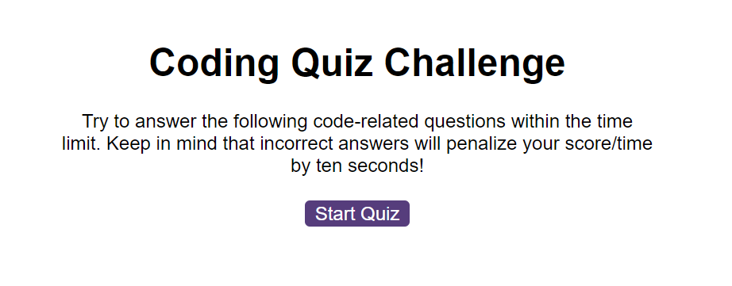
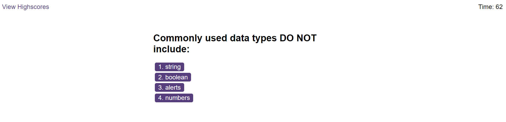
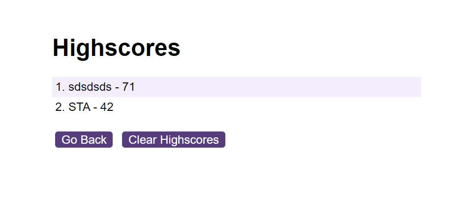

# Console-Finances

## Description

This project is to demonstrate my use of JavaScript to create a JavaScript themed quiz, it will ask the user questions and provide 4 choices, on a wrong answer it till minus 15 second from the total timer, on a correct answer it will move to the next question. When all questions are answered, or if the time runs out, the quiz will end. The remaining time is the score presented at the end, this will be saved in a scoreboard.

## Table of Contents

* [Installation](#installation)
* [Usage](#usage)
* [License](#license)

## Installation

Visit URL: https://symoxn7.github.io/code-quiz/

## Usage 

Click "Start Quiz" for the first question. Continue to select answers for each question. When the end is reached it will save the score to view. TGhe highscores can be cleared with the "Clear Highscore button"

Screenshots of functionality:

### Start Quiz

### Question

### Scoreboard

## License

MIT License

Copyright (c) 2023 Symox

Permission is hereby granted, free of charge, to any person obtaining a copy
of this software and associated documentation files (the "Software"), to deal
in the Software without restriction, including without limitation the rights
to use, copy, modify, merge, publish, distribute, sublicense, and/or sell
copies of the Software, and to permit persons to whom the Software is
furnished to do so, subject to the following conditions:

The above copyright notice and this permission notice shall be included in all
copies or substantial portions of the Software.

THE SOFTWARE IS PROVIDED "AS IS", WITHOUT WARRANTY OF ANY KIND, EXPRESS OR
IMPLIED, INCLUDING BUT NOT LIMITED TO THE WARRANTIES OF MERCHANTABILITY,
FITNESS FOR A PARTICULAR PURPOSE AND NONINFRINGEMENT. IN NO EVENT SHALL THE
AUTHORS OR COPYRIGHT HOLDERS BE LIABLE FOR ANY CLAIM, DAMAGES OR OTHER
LIABILITY, WHETHER IN AN ACTION OF CONTRACT, TORT OR OTHERWISE, ARISING FROM,
OUT OF OR IN CONNECTION WITH THE SOFTWARE OR THE USE OR OTHER DEALINGS IN THE
SOFTWARE.
